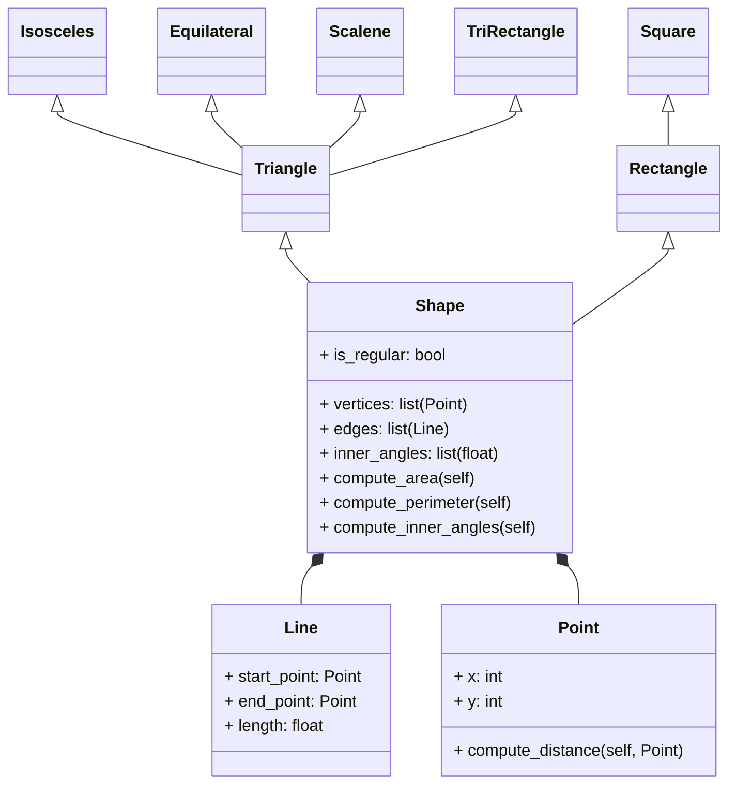

# CHALLENGE_04
## Class exercise 
1. Create a superclass called Shape(), which is the base of the classes Reactangle() and Square(), define the methods compute_area and compute_perimeter in Shape() and then using polymorphism redefine the methods properly in Rectangle and in Square.
```python
class Shape:
    def __init__(self):
        pass

    def compute_area(self):
        pass

    def compute_perimeter(self):
        pass


class Rectangle(Shape):
    def __init__(self, width, height):
        self.width = width
        self.height = height

    def compute_area(self):
        return self.width * self.height

    def compute_perimeter(self):
        return 2 * (self.width + self.height)


class Square(Shape):
    def __init__(self, lenght):
        self.lenght = lenght

    def compute_area(self):
        return self.lenght ** 2

    def compute_perimeter(self):
        return 4 * self.lenght
```
In this code i define two classes, Rectangle and Square, both of which are subclasses of a superclass Shape. 

The Rectangle class also has two methods: compute_area and compute_perimeter. The compute_area method returns the area of the rectangle (width * height), and the compute_perimeter method returns the perimeter of the rectangle (2 * (width + height))

The Square class is similar to the Rectangle class, but it only has one instance variable: length. This is because all sides of a square have the same length. The compute_area method returns the area of the square (length ** 2), and the compute_perimeter method returns the perimeter of the square (4 * length).

2. Using the classes Point() and Line() define a new super-class Shape() with the following structure:

### Definition of the classes Point() and Line()
```python
import math

class Point:
    def __init__(self, x, y):
        self._x = x
        self._y = y

    def compute_distance(self, other):
        return math.sqrt((self._x - other._x)**2 + (self._y - other._y)**2)

    def get_x(self):
        return self._x

    def set_x(self, value):
        self._x = value

    def get_y(self):
        return self._y

    def set_y(self, value):
        self._y = value


class Line:
    def __init__(self, start_point: Point, end_point:Point):
        self._start_point = start_point
        self._end_point = end_point
        self._length = start_point.compute_distance(end_point)

    def get_length(self):
        return self._length

    def get_start_point(self):
        return self._start_point

    def set_start_point(self, value):
        self._start_point = value
        self._length = self._start_point.compute_distance(self._end_point)

    def get_end_point(self):
        return self._end_point

    def set_end_point(self, value):
        self._end_point = value
        self._length = self._start_point.compute_distance(self._end_point)
```
The Point class represents a point in a 2D space. It has two instance variables: _x and _y, which represent the x and y coordinates of the point.

This class also has a method compute_distance that calculates the distance between this point and another point. It does this using the formula sqrt((x2 - x1)^2 + (y2 - y1)^2), where (x1, y1) are the coordinates of this point and (x2, y2) are the coordinates of the other point.

The Point class also has getter and setter methods for the _x and _y instance variables. These methods allow the instance variables to be read and modified from outside the class.

In another hand, thw Line class represents a line in a 2D space. It has three instance variables: _start_point, _end_point, and _length. The _start_point and _end_point variables are objects of the Point class and represent the start and end points of the line. The _length variable is the length of the line, which is calculated as the distance between the start point and the end point.
The Line class also has getter and setter methods for the _start_point, _end_point, and _length instance variables. The setter methods for _start_point and _end_point also update the _length variable to reflect the new length of the line.
### class Shape:
```python
class Shape:
    def __init__(self, vertices):
        self._vertices = vertices
        self._edges = [Line(vertices[i], vertices[(i+1)%len(vertices)]) for i in range(len(vertices))]
        self._inner_angles = self.compute_inner_angles()
        self._is_regular = self.check_regular()

    def compute_area(self):
        raise NotImplementedError

    def compute_perimeter(self):
        return sum(edge.get_length() for edge in self._edges)

    def compute_inner_angles(self):
        raise NotImplementedError

    def check_regular(self):
        return all(edge.get_length() == self._edges[0].get_length() for edge in self._edges)

    def get_vertices(self):
        return self._vertices

    def set_vertices(self, value):
        self._vertices = value
        self._edges = [Line(self._vertices[i], self._vertices[(i+1)%len(self._vertices)]) for i in range(len(self._vertices))]
        self._inner_angles = self.compute_inner_angles()
        self._is_regular = self.check_regular()

    def get_edges(self):
        return self._edges

    def get_inner_angles(self):
        return self._inner_angles

    def is_regular(self):
        return self._is_regular
```
The Shape class is designed to represent a generic geometric shape. It doesn't directly inherit from Point or Line, but it uses instances of these classes to define its properties.
The constructor method __init__ gets called when a new instance of Shape is created. It takes a list of Point instances (vertices) as an argument. It then creates a list of Line instances (_edges) representing the edges of the shape, where each edge is a line between two consecutive vertices, ****(This is composition at its best, Shape is composed of instances of other classes (Point and Line).**** It also computes the inner angles of the shape and checks if the shape is regular (all edges have the same length).

compute_area: This method is intended to compute the area of the shape. It raises a NotImplementedError, meaning it should be implemented in a subclass.

compute_perimeter: This method computes the perimeter of the shape by summing the lengths of all edges.

compute_inner_angles: This method is intended to compute the inner angles of the shape. Like compute_area, it raises a NotImplementedError and should be implemented in a subclass.

check_regular: This method checks if the shape is regular (all edges have the same length).

get_vertices, set_vertices, get_edges, get_inner_angles, is_regular: These are getter and setter methods for the vertices, edges, inner angles, and regularity of the shape.(**encasulation**)
```python
class Triangle(Shape):
    def __init__(self, vertices):
        super().__init__(vertices)

    def compute_area(self):
        # Using Heron's formula
        a, b, c = self._edges[0].get_length(), self._edges[1].get_length(), self._edges[2].get_length()
        s = (a + b + c) / 2
        return math.sqrt(s * (s - a) * (s - b) * (s - c))

    def compute_inner_angles(self):
        # Using the law of cosines
        a, b, c = self._edges[0].get_length(), self._edges[1].get_length(), self._edges[2].get_length()
        return [math.degrees(math.acos((b**2 + c**2 - a**2) / (2 * b * c))),
                math.degrees(math.acos((a**2 + c**2 - b**2) / (2 * a * c))),
                math.degrees(math.acos((a**2 + b**2 - c**2) / (2 * a * b)))]


class Isosceles(Triangle):
    def __init__(self, vertices):
        super().__init__(vertices)


class Equilateral(Triangle):
    def __init__(self, vertices):
        super().__init__(vertices)


class Scalene(Triangle):
    def __init__(self, vertices):
        super().__init__(vertices)


class TriRectangle(Triangle):
    def __init__(self, vertices):
        super().__init__(vertices)


class Rectangle(Shape):
    def __init__(self, vertices):
        super().__init__(vertices)

    def compute_area(self):
        return self._edges[0].get_length() * self._edges[1].get_length()

    def compute_inner_angles(self):
        return [90] * 4


class Square(Rectangle):
    def __init__(self, vertices):
        super().__init__(vertices)

# Create the points
p1 = Point(0, 0)
p2 = Point(2, 5)
p3 = Point(4, 0)

# Create the isosceles triangle
isosceles = Isosceles([p1, p2, p3])

# Print the Area, Perimeter and Inner angles of the Isosceles triangle
print("ISOSCELES TRIANGLE")
print("Area:", isosceles.compute_area())
print("Perimeter:", isosceles.compute_perimeter())
print("Inner angles:", isosceles.compute_inner_angles())
print("\n")

#EQUILATERAL TRIANGLE
r1 = Point(0, 0)
r2 = Point(1, 0)
r3 = Point(0.5, 0.8660254037844386)  # This creates an equilateral triangle with side length 1

equilateral = Equilateral([r1, r2, r3])

print("EQUILATERAL TRIANGLE")
print("Area:", equilateral.compute_area())
print("Perimeter:", equilateral.compute_perimeter())
print("Inner angles:", equilateral.compute_inner_angles())
print("\n")

#SCALENE TRIANGLE
m1 = Point(2, 0)
m2 = Point(3, 5)
m3 = Point(6, 0)

scalene = Scalene([m1, m2, m3])

print("SCALENE TRIANGLE")
print("Area:", scalene.compute_area())
print("Perimeter:", scalene.compute_perimeter())
print("Inner angles:", scalene.compute_inner_angles())
print("\n")

#RECTANGLE TRIANGLE
f1 = Point(0, 0)
f2 = Point(6, 4)
f3 = Point(6, 0)

tri_rectangle = TriRectangle([f1, f2, f3])

print("RECTANGLE TRIANGLE")
print("Area:", tri_rectangle.compute_area())
print("Perimeter:", tri_rectangle.compute_perimeter())
print("Inner angles:", tri_rectangle.compute_inner_angles())
print("\n")

#Rectangle
b1 = Point(0, 0)
b2 = Point(6, 2)
b3 = Point(6, 0)
b4 = Point(0, 2)

rectangle = Rectangle([b1, b2, b3, b4])

print("RECTANGLE")
print("Area:", rectangle.compute_area())
print("Perimeter:", rectangle.compute_perimeter())
print("Inner angles:", rectangle.compute_inner_angles())
print("\n")

# Square
g1 = Point(0, 0)
g2 = Point(0, 4)
g3 = Point(4, 4)
g4 = Point(4, 0)

square = Square([g1, g2, g3, g4])

print("SQUARE")
print("Area:", square.compute_area())
print("Perimeter:", square.compute_perimeter())
print("Inner angles:", square.compute_inner_angles())
```
In thus part of the code i defined several classes that represent different types of geometric shapes, specifically different types of triangles and quadrilaterals. These classes ****inherit**** from the Shape, Triangle, and Rectangle classes defined earlier.

Triangle: This class ****inherits**** from Shape and overrides the compute_area and compute_inner_angles methods to provide implementations specific to triangles. The area is computed using Heron's formula, and the inner angles are computed using the law of cosines.

Isosceles, Equilateral, Scalene, TriRectangle: These classes inherit from Triangle. They exist to represent specific types of triangles, and could be extended in the future to provide behavior specific to these types of triangles.

Rectangle: This class inherits from Shape and overrides the compute_area and compute_inner_angles methods to provide implementations specific to rectangles. The area is computed as the product of the lengths of two adjacent edges, and the inner angles are all 90 degrees.

Square: This class inherits from Rectangle but doesn't provide any new methods. It exists to represent squares.

Ater that I create instances of these classes to represent specific shapes. For each shape, it creates Point instances to represent the vertices of the shape, then creates an instance of the appropriate class (e.g., Isosceles, Equilateral, Scalene, TriRectangle, Rectangle, Square) using these vertices. It then prints the area, perimeter, and inner angles of each shape.
